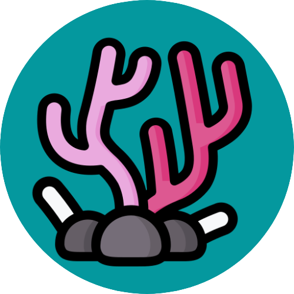

<!-- prettier-ignore-start -->
<!-- ALL-CONTRIBUTORS-BADGE:START - Do not remove or modify this section -->

<!-- ALL-CONTRIBUTORS-BADGE:END -->
<!-- prettier-ignore-end -->

# Coral Design System

> Corals 🪸 are a reef's basic components, so they are for [DiveTool](https://github.com/divetool/divetool).

## Projects

| Name          | Package                                                                          | Version                                                                                                                                           |
| ------------- | -------------------------------------------------------------------------------- | ------------------------------------------------------------------------------------------------------------------------------------------------- |
| Coral         | [`@divetool/coral`](https://www.npmjs.com/package/@divetool/coral)               |                  |
| Coral React   | [`@divetool/coral-react`](https://www.npmjs.com/package/@divetool/coral-react)   |      |
| Coral Angular | [`@divetool/coral-angular`](https://www.npmjs.com/package/@divetool/coral-react) |  |

## Support

Reach out to the project maintainers at one of the following places:

- [GitHub Discussions](https://github.com/divetool/coral/discussions)
- Our [#support](https://discord.com/channels/1038293874189279252/1038294430815375502) channel in the [DiveTool Community](https://discord.gg/Ug3cb4QD3f) discord server.
- If you need to privately contact the project maintainers, DM them through our [DiveTool Community](https://discord.gg/Ug3cb4QD3f) discord server.

## Contributing

First off, thanks for taking the time to contribute! Contributions are what make the open-source community such an amazing place to learn, inspire, and create. Any contributions you make will benefit everybody else and are **greatly appreciated**.

## Code of conduct

DiveTool is dedicated to providing a welcoming, diverse, and harrassment-free experience for everyone. We expect everyone in the DiveTool community to abide by our [**Code of Conduct**](docs/CODE_OF_CONDUCT.md). Please read it.

## License

This project is licensed under the **MIT License**.

See [LICENSE](LICENSE) for more information.

## Credits

- Logo “[Coral, diving, nature icon](https://www.iconfinder.com/icons/8935918/coral_diving_nature_ocean_reef_icon)” by [Lima Studio](https://www.iconfinder.com/khrl11) is licensed under [CC BY 4.0](https://creativecommons.org/licenses/by/4.0/).

## Contributors ✨

Thanks goes to these wonderful people ([emoji key](https://allcontributors.org/docs/en/emoji-key)):

<!-- ALL-CONTRIBUTORS-LIST:START - Do not remove or modify this section -->
<!-- prettier-ignore-start -->
<!-- markdownlint-disable -->
<table>
  <tbody>
    <tr>
      <td align="center"><a href="https://sebastiandg.com/"> <b>Sebastian Duque Gutierrez</b></a> <a href="https://github.com/divetool/coral/commits?author=sebastiandg7" title="Code">💻</a> <a href="#tool-sebastiandg7" title="Tools">🔧</a> <a href="https://github.com/divetool/coral/pulls?q=is%3Apr+reviewed-by%3Asebastiandg7" title="Reviewed Pull Requests">👀</a> <a href="#ideas-sebastiandg7" title="Ideas, Planning, & Feedback">🤔</a> <a href="#infra-sebastiandg7" title="Infrastructure (Hosting, Build-Tools, etc)">🚇</a> <a href="#maintenance-sebastiandg7" title="Maintenance">🚧</a> <a href="#projectManagement-sebastiandg7" title="Project Management">📆</a></td>
      <td align="center"><a href="https://cv-portfolio-angular.vercel.app/home"> <b>Andrés Valencia Díaz </b></a> <a href="https://github.com/divetool/coral/commits?author=AndresVD21" title="Code">💻</a> <a href="https://github.com/divetool/coral/pulls?q=is%3Apr+reviewed-by%3AAndresVD21" title="Reviewed Pull Requests">👀</a> <a href="#design-AndresVD21" title="Design">🎨</a> <a href="#ideas-AndresVD21" title="Ideas, Planning, & Feedback">🤔</a></td>
      <td align="center"><a href="https://github.com/mariacuadros"> <b>Maria del Mar Cuadros</b></a> <a href="https://github.com/divetool/coral/pulls?q=is%3Apr+reviewed-by%3Amariacuadros" title="Reviewed Pull Requests">👀</a></td>
      <td align="center"><a href="https://github.com/santidelosrios"> <b>Santiago De Los Ríos</b></a> <a href="#projectManagement-santidelosrios" title="Project Management">📆</a></td>
      <td align="center"><a href="https://github.com/booleanaVillegas"> <b>Juliana Villegas</b></a> <a href="#ideas-booleanaVillegas" title="Ideas, Planning, & Feedback">🤔</a> <a href="#design-booleanaVillegas" title="Design">🎨</a> <a href="#maintenance-booleanaVillegas" title="Maintenance">🚧</a></td>
    </tr>
  </tbody>
  <tfoot>
    <tr>
      <td align="center" size="13px" colspan="7">
        
          <a href="https://all-contributors.js.org/docs/en/bot/usage">Add your contributions</a>
        </img>
      </td>
    </tr>
  </tfoot>
</table>

<!-- markdownlint-restore -->
<!-- prettier-ignore-end -->

<!-- ALL-CONTRIBUTORS-LIST:END -->

This project follows the [all-contributors](https://github.com/all-contributors/all-contributors) specification. Contributions of any kind welcome!
